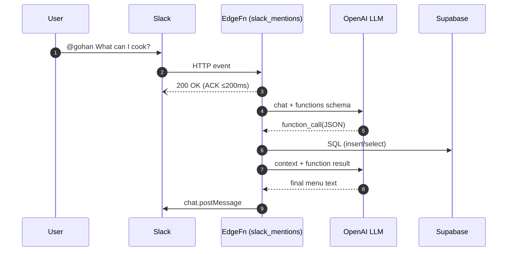

# gohan-bot

**Dinner-Assistant Slack Bot** powered by Supabase Edge Functions (Deno) and OpenAI.

---

## Table of Contents
1. [Overview](#overview)
2. [Architecture](#architecture)
3. [Prerequisites](#prerequisites)
4. [Setup & Development](#setup--development)
5. [Local Testing](#local-testing)
6. [Deployment](#deployment)
7. [Database Schema](#database-schema)
8. [Usage](#usage)
9. [Future Improvements](#future-improvements)
10. [License](#license)

## Overview
`gohan-bot` is a Slack app that helps users manage fridge items and log meals. It uses:
- **Supabase Edge Functions** (single-file Deno workers)
- **OpenAI** LLM with function-calling for precise operations
- **EdgeRuntime.waitUntil** for non-blocking acknowledgments

## Architecture



## Prerequisites
- Supabase CLI (`supabase`) installed
- Deno (v1.40+) installed
- A Supabase project with:
  - Edge Functions enabled
  - Secrets: `SUPABASE_URL`, `SUPABASE_SERVICE_ROLE_KEY`
- A Slack App with scopes: `chat:write`, `app_mentions:read`
- OpenAI API key (`OPENAI_API_KEY`)

## Setup & Development

1. Clone the repo:
   ```bash
   git clone https://github.com/bonyuta0204/gohan-bot.git
   cd gohan-bot
   ```
2. Initialize Supabase (if not already):
   ```bash
   supabase init
   ```
3. Set environment variables (locally in `.env` or via Supabase secrets):
   ```bash
   supabase secrets set \
     SUPABASE_URL=<your_supabase_url> \
     SUPABASE_SERVICE_ROLE_KEY=<service_role_key> \
     SLACK_TOKEN=<bot_token> \
     SLACK_SIGNING_SECRET=<signing_secret> \
     OPENAI_API_KEY=<openai_api_key>
   ```
4. Open in VS Code (with Deno extension) for IntelliSense.

## Local Testing

1. Start local Supabase emulator:
   ```bash
   supabase start
   ```
2. Serve functions:
   ```bash
   supabase functions serve slack_mentions handle_message
   ```
3. Test via `curl`:
   ```bash
   # Test handle_message
   curl http://127.0.0.1:54321/functions/v1/handle_message \
     -H "Content-Type: application/json" \
     --data '{"userMessage":"Add milk to fridge"}'
   ```
4. (Optional) Expose to Slack with `ngrok`:
   ```bash
   ngrok http 54321
   ```
   Update your Slack App Request URL to `https://<ngrok_id>.ngrok.io/slack_mentions`.

## Deployment

1. Ensure secrets are set in your Supabase project.
2. Deploy functions:
   ```bash
   supabase functions deploy slack_mentions
   supabase functions deploy handle_message
   ```
3. Apply database schema (via SQL editor or `psql`):
   ```sql
   create table if not exists fridge_items (
     id bigserial primary key,
     user_slack_id text not null,
     item_name text not null,
     added_at timestamptz default now()
   );

   create table if not exists meal_logs (
     id bigserial primary key,
     user_slack_id text not null,
     meal_name text not null,
     eaten_at date default current_date
   );
   ```
4. Invite the bot to your Slack channel and mention it to start.

## Database Schema

Tables:
- `fridge_items(user_slack_id, item_name, added_at)`
- `meal_logs(user_slack_id, meal_name, eaten_at)`

## Usage
- `add_fridge_item` to store new items
- `record_meal` to log meals
- `fetch_recent_items` to view the latest items

## Future Improvements
- Retry and error-handling strategies
- Item quantities and expiration dates
- User-specific preferences and settings

## License
MIT © 2025 bonyuta0204
